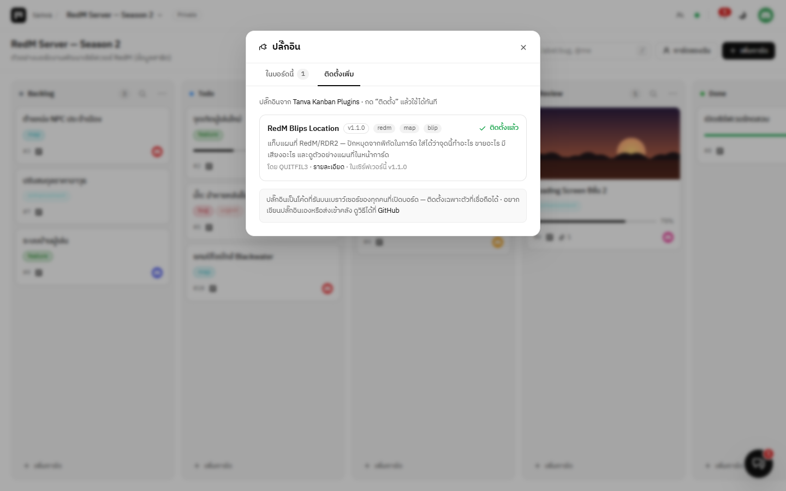
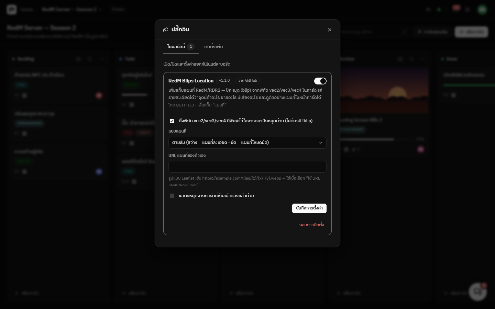

# Tanva Kanban Plugins

คลังปลั๊กอินทางการของ **Tanva Kanban** — กดติดตั้ง อัปเดต และถอนได้จากในบอร์ดเลย

[](https://github.com/QUITFIL3/tanva-kanban-plugins/actions/workflows/ci.yml)
[](LICENSE)



## ปลั๊กอิน

| ปลั๊กอิน | เวอร์ชัน | ทำอะไร |
| --- | --- | --- |
| [**AI Assistant**](plugins/ai_assistant) | 1.2.0 | ผู้ช่วย AI แผงด้านขวาของจอ สั่งงานบอร์ดด้วยภาษาคน — สรุปงาน ค้นการ์ด สร้าง/แก้/ย้ายการ์ด (ถามก่อนแก้ทุกครั้ง) · บอกสถานะว่ากำลังคิดอะไร ใช้เวลาไปเท่าไร · ใช้ความสามารถของปลั๊กอินอื่นในบอร์ดได้ · Claude, OpenAI, OpenRouter, Gemini, Groq, DeepSeek, Mistral, xAI |
| [**RedM Blips Location**](plugins/redm_blips_location) | 1.3.0 | แท็บแผนที่ RedM/RDR2 — ปักหมุดจากพิกัด `vec2/vec3/vec4` ในการ์ด ใช้รูป blip ของเกมได้ครบ 586 แบบ (ชุดเดียวกับ redlookup.com) ใส่ได้ว่าจุดนี้ทำอะไร ขายอะไร มีเสียงอะไร กดดูแผนที่จากการ์ดได้ทันที มีคำแนะนำตอนพิมพ์ `!blip` และให้ผู้ช่วย AI ใช้ได้ |

## ติดตั้ง

ในบอร์ดของ Tanva Kanban (ต้องเป็นแอดมิน):

1. เมนูบอร์ด → **ปลั๊กอิน / ติดตั้งเพิ่ม** (หรือปุ่มรูปปลั๊กข้างแท็บ **บอร์ด / ประวัติ**)
2. แท็บ **ติดตั้งเพิ่ม** → กด **ติดตั้ง**
3. ปลั๊กอินถูกเปิดใช้ในบอร์ดที่เปิดอยู่ให้ทันที — บอร์ดอื่นเปิด/ปิดได้จากแท็บ **จัดการปลั๊กอิน** และกด **ตั้งค่า** ที่ปลั๊กอินเพื่อเปิดหน้าต่างตั้งค่าแยกรายบอร์ด



เมื่อคลังนี้มีรุ่นใหม่ หน้าต่างปลั๊กอินจะขึ้นปุ่ม **อัปเดต** ให้เอง · รายละเอียดเพิ่มเติมอยู่ใน [คู่มือปลั๊กอิน](docs/plugins.md)

### ปลั๊กอินที่ไม่ได้อยู่ในคลังนี้

แท็บ **ติดตั้งเพิ่ม** มีช่อง **ติดตั้งจากลิงก์ GitHub** — วางลิงก์ repo (หรือโฟลเดอร์) ของปลั๊กอินที่มี `manifest.json` แล้วกดตรวจสอบ
ระบบจะให้ดูรายละเอียดและคำเตือนก่อนติดตั้งเสมอ ([ดูเพิ่ม](docs/plugins.md#ติดตั้งจากลิงก์-github))

เขียนปลั๊กอินแจกเองก็แค่วางไว้ใน repo สาธารณะของตัวเอง แล้วส่งลิงก์ให้คนอื่น — ไม่ต้องส่งเข้าคลังนี้ก็ได้
ถ้าอยากให้คนเจอง่ายและผ่านการตรวจโค้ด ค่อยส่งเข้าคลังตามขั้นตอนด้านล่าง

## ส่งปลั๊กอินเข้าคลัง

1. Fork repo นี้ แล้วสร้างโฟลเดอร์ `plugins/<id>/` — `id` ใช้ได้เฉพาะ `a-z 0-9 _ -` และต้องตรงกับ `id` ใน `manifest.json`
   (วิธีเขียนปลั๊กอิน: [docs/plugins.md](docs/plugins.md#เขียนปลั๊กอินเอง))
2. ประกาศทุกไฟล์ที่ต้องใช้ใน `manifest.json` (`entry` `styles` `files`) — ตอนติดตั้งระบบดาวน์โหลด **เฉพาะไฟล์ที่ประกาศไว้**
3. เพิ่มปลั๊กอินใน `registry.json` (เวอร์ชันต้องตรงกับ `manifest.json`)
   ```json
   {
     "id": "my_plugin",
     "name": "My Plugin",
     "description": "ทำอะไร",
     "version": "1.0.0",
     "author": "<GitHub username>",
     "tags": ["tag"],
     "homepage": "https://github.com/QUITFIL3/tanva-kanban-plugins/tree/main/plugins/my_plugin",
     "path": "plugins/my_plugin"
   }
   ```
4. ใส่ `README.md` ในโฟลเดอร์ปลั๊กอิน บอกว่าทำอะไรและใช้ยังไง
5. ตรวจก่อนส่ง แล้วเปิด pull request
   ```bash
   npm run validate   # registry.json ตรงกับ manifest, ไฟล์ครบ, ชื่อไฟล์และขนาดผ่านกฎเดียวกับตอนติดตั้ง
   npm test           # เทสต์ของปลั๊กอิน (ถ้ามี — วางไว้ที่ test/<id>.test.mjs)
   ```

**กติกาของคลัง**

- ไฟล์ละไม่เกิน 2 MB รวมไม่เกิน 10 MB ต่อปลั๊กอิน · ไม่มีโฟลเดอร์ย่อย
- ห้ามส่งข้อมูลของผู้ใช้ออกไปนอกเซิร์ฟเวอร์โดยไม่บอกไว้ชัด ๆ ใน README
- ไลบรารีภายนอกโหลดจาก CDN ที่เชื่อถือได้และระบุเวอร์ชันให้ชัด (เช่น `https://cdn.jsdelivr.net/npm/leaflet@1.9.4/…`)
- อัปเดตปลั๊กอิน = ขยับ `version` ทั้งใน `manifest.json` และ `registry.json`

> ปลั๊กอินรันบนเบราว์เซอร์ของทุกคนที่เปิดบอร์ด ทุก pull request จึงถูกอ่านโค้ดก่อน merge

## ใช้คลังของตัวเอง

Fork repo นี้ แล้วตั้งใน `.env` ของ Tanva Kanban

```ini
PLUGIN_REGISTRY_URL=https://raw.githubusercontent.com/<you>/tanva-kanban-plugins/main/registry.json
```

## License

[MIT](LICENSE) © QUITFIL3 — ปลั๊กอินแต่ละตัวใช้ license เดียวกับคลัง เว้นแต่ระบุไว้ในโฟลเดอร์ของปลั๊กอินนั้น
