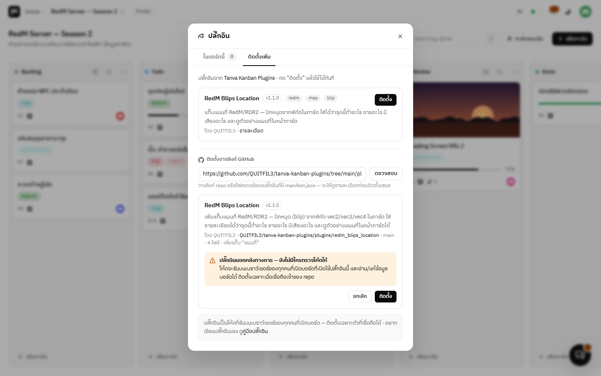
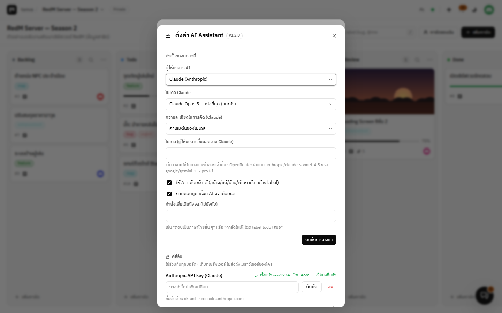

# ปลั๊กอิน

[← กลับหน้าคลังปลั๊กอิน](../README.md)

ปลั๊กอินเพิ่มความสามารถให้บอร์ดของ Tanva Kanban ได้โดยไม่ต้องแก้โค้ดหลัก — เพิ่ม **แท็บของตัวเอง** (เช่นแผนที่), **แผงด้านขวาของจอ** (เช่นผู้ช่วย AI),
**กล่องในแถบข้างของการ์ด** และ **ตกแต่งเนื้อหาการ์ด** (เช่นเปลี่ยนบล็อกข้อความพิเศษเป็นกล่องสวย ๆ) · แต่ละบอร์ดเลือกเปิดเองและตั้งค่าแยกกัน

- [ติดตั้งจากคลัง](#ติดตั้งจากคลัง)
- [ติดตั้งจากลิงก์ GitHub](#ติดตั้งจากลิงก์-github)
- [เปิด/ปิดและตั้งค่ารายบอร์ด](#เปิดปิดและตั้งค่ารายบอร์ด)
- [คีย์ลับของปลั๊กอิน (API key)](#คีย์ลับของปลั๊กอิน-api-key)
- [ปลั๊กอินในคลังทางการ](#ปลั๊กอินในคลังทางการ)
- [ติดตั้งเองโดยไม่ผ่านคลัง](#ติดตั้งเองโดยไม่ผ่านคลัง)
- [ใช้คลังของตัวเอง หรือปิดการติดตั้ง](#ใช้คลังของตัวเอง-หรือปิดการติดตั้ง)
- [เขียนปลั๊กอินเอง](#เขียนปลั๊กอินเอง)

---

## ติดตั้งจากคลัง


1. เมนูบอร์ด → **ปลั๊กอิน / ติดตั้งเพิ่ม** (หรือปุ่มรูปปลั๊กข้างแท็บ **บอร์ด / ประวัติ**)
2. แท็บ **ติดตั้งเพิ่ม** → กด **ติดตั้ง** ที่ปลั๊กอินที่ต้องการ
3. ปลั๊กอินถูกเปิดใช้ในบอร์ดที่เปิดอยู่ให้ทันที — บอร์ดอื่นเปิดเองได้จากแท็บ **จัดการปลั๊กอิน**

| ทำอะไร | เป็นยังไง |
| --- | --- |
| **อัปเดต** | คลังมีรุ่นใหม่ = ขึ้นปุ่ม **อัปเดต** ในหน้าต่างปลั๊กอิน (ค่าตั้งของทุกบอร์ดยังอยู่) |
| **ถอนการติดตั้ง** | แท็บ **จัดการปลั๊กอิน** → กด **ตั้งค่า** ที่ปลั๊กอิน → **ถอนการติดตั้ง** ท้ายหน้าต่างตั้งค่า — ลบไฟล์ออกจากเซิร์ฟเวอร์ |
| ใครทำได้ | ติดตั้ง/อัปเดต/ถอน = **แอดมินที่ล็อกอินจริง** (Discord หรือ Google) เท่านั้น (API token ทำไม่ได้) |
| ไฟล์ไปอยู่ไหน | `data/plugins/<id>/` — อยู่รอดตอนอัปเดตเวอร์ชันของ Tanva Kanban |

ระหว่างติดตั้ง ระบบดาวน์โหลด **เฉพาะไฟล์ที่ประกาศไว้ใน `manifest.json`** (ไฟล์ละไม่เกิน 2 MB รวมไม่เกิน 10 MB)
ลงโฟลเดอร์ชั่วคราวก่อน แล้วค่อยสลับเข้าที่ — ถ้าดึงไม่ครบหรือไฟล์ผิดรูปแบบ **ของเดิมจะไม่ถูกแตะเลย**

> **ปลั๊กอินคือโค้ดที่รันบนเบราว์เซอร์ของทุกคนที่เปิดบอร์ด** อ่านและแก้ข้อมูลได้เท่ากับคนที่เปิดอยู่ —
> ติดตั้งเฉพาะปลั๊กอินที่เชื่อถือได้ (ปลั๊กอินในคลังทางการผ่านการตรวจก่อน merge)

---

## ติดตั้งจากลิงก์ GitHub

ปลั๊กอินที่ไม่ได้อยู่ในคลังทางการ (เช่นของทีมเอง หรือที่คนอื่นเขียนแจก) ติดตั้งได้ด้วยการวางลิงก์ GitHub ของโปรเจกต์นั้น



1. แท็บ **ติดตั้งเพิ่ม** → ช่อง **ติดตั้งจากลิงก์ GitHub** → วางลิงก์ → **ตรวจสอบ**
2. ระบบดึงแค่ `manifest.json` มาให้ดูก่อน — ชื่อ เวอร์ชัน ผู้เขียน จำนวนไฟล์ แท็บ/แผงที่จะเพิ่ม (ยังไม่มีอะไรถูกติดตั้ง)
3. อ่านคำเตือนแล้วกด **ติดตั้ง** — ใช้กฎเดียวกับการติดตั้งจากคลังทุกข้อ (ดึงเฉพาะไฟล์ที่ประกาศไว้ ขนาดจำกัด ดึงไม่ครบ = ไม่ติดตั้ง)

ลิงก์ที่ใช้ได้

| ลิงก์ | ความหมาย |
| --- | --- |
| `https://github.com/<owner>/<repo>` | ปลั๊กอินอยู่ที่รากของ repo (branch หลัก) |
| `https://github.com/<owner>/<repo>/tree/<branch>/<โฟลเดอร์>` | ปลั๊กอินอยู่ในโฟลเดอร์ย่อย หรือเลือก branch/tag |
| `https://github.com/<owner>/<repo>/blob/<branch>/<โฟลเดอร์>/manifest.json` | ลิงก์ไปที่ไฟล์ manifest ก็ได้ |
| `<owner>/<repo>` หรือ `<owner>/<repo>/<โฟลเดอร์>` | แบบย่อ |

- ถ้า repo นั้นมี **หลายปลั๊กอิน** (มี `registry.json` แบบเดียวกับคลังทางการ) จะขึ้นรายการให้เลือกตัวที่ต้องการ
- repo ต้องเป็นแบบ **สาธารณะ** · ชื่อ branch ที่มี `/` ให้ใช้ชื่อ tag หรือเลข commit แทน
- ระบบจำที่มาไว้ — แท็บ **จัดการปลั๊กอิน** จะขึ้นชื่อ repo ของปลั๊กอิน และปุ่ม **อัปเดต** เมื่อ repo นั้นมีเวอร์ชันใหม่กว่า
- ติดตั้งได้เฉพาะ **แอดมินที่ล็อกอินจริง** · ปิดความสามารถนี้ได้ด้วย `PLUGIN_GITHUB_INSTALL=0`

> ปลั๊กอินนอกคลังทางการยังไม่มีใครตรวจโค้ดให้ — ติดตั้งเฉพาะเมื่อเชื่อถือเจ้าของ repo

---

## เปิด/ปิดและตั้งค่ารายบอร์ด


แท็บ **จัดการปลั๊กอิน** แสดงปลั๊กอินทั้งหมดที่ติดตั้งไว้ แบบย่อ — ชื่อ คำอธิบาย และสวิตช์

- สวิตช์ด้านขวา = เปิด/ปิดในบอร์ดนี้ · ปลั๊กอินที่มีแท็บจะขึ้นแท็บต่อจาก **บอร์ด / ประวัติ** ส่วนปลั๊กอินที่มีแผงด้านขวาจะขึ้นปุ่มบนหัวเว็บ ทันทีที่เปิด
- กดปุ่ม **ตั้งค่า** ใต้ปลั๊กอิน = เปิด**หน้าต่างตั้งค่าของปลั๊กอินนั้น**ซ้อนขึ้นมา (ค่าตั้งของบอร์ดนี้ · คีย์ลับ · ถอนการติดตั้ง) รายการปลั๊กอินจะได้ไม่ยาว · **Esc** หรือคลิกข้างนอกเพื่อปิด
- แก้ค่าแล้วกด **บันทึกการตั้งค่า** — ค่าตั้งแยกกันในแต่ละบอร์ด และยังจำไว้แม้ปิดปลั๊กอินไปแล้ว


- ป้าย **ยังไม่ได้ตั้งคีย์** ข้างปุ่มตั้งค่า = ปลั๊กอินต้องใช้ API key แต่แอดมินยังไม่ได้ตั้งสักตัว
- เปลี่ยนได้เฉพาะ **คนสร้างบอร์ดหรือแอดมิน** · ทุกการเปิด/ปิด/ตั้งค่าถูกบันทึกในแท็บประวัติ
- ทุกคนที่เปิดบอร์ดเห็นผลทันทีผ่านระบบอัปเดตสด

---

## คีย์ลับของปลั๊กอิน (API key)


ปลั๊กอินที่ต้องเรียกบริการภายนอก (เช่น **AI Assistant** ที่คุยกับ Claude, OpenAI, OpenRouter …) จะมีกล่อง **คีย์ลับ** —
กด **ตั้งค่า** ที่ปลั๊กอินในแท็บ **จัดการปลั๊กอิน** แล้ววางคีย์ → **บันทึก** (ปลั๊กอินที่รองรับหลายเจ้า ตั้งแค่ของเจ้าที่ใช้ก็พอ)

- ตั้งได้เฉพาะ **แอดมินที่ล็อกอินจริง** · ใช้ร่วมกันทุกบอร์ด
- เก็บใน `data/plugin-secrets.json` ฝั่งเซิร์ฟเวอร์ — **ไม่มีเส้นทางไหนส่งค่าจริงกลับไปที่เบราว์เซอร์** แอดมินเห็นแค่ 4 ตัวท้าย ใครตั้ง เมื่อไร
- ปลั๊กอินใช้คีย์ได้ทางเดียว: ขอให้เซิร์ฟเวอร์ส่งต่อคำขอ (proxy) ไปยังปลายทางที่ manifest ประกาศไว้ แล้วเซิร์ฟเวอร์เติมคีย์ให้
- proxy ใช้ได้เฉพาะบอร์ดที่เปิดปลั๊กอินนั้น เฉพาะสมาชิกที่ล็อกอิน (API token ใช้ไม่ได้) และจำกัดครั้งต่อนาที (`PLUGIN_PROXY_PER_MINUTE`)
- ถอนปลั๊กอิน = คีย์ของมันถูกลบไปด้วย

---

## ปลั๊กอินในคลังทางการ

| ปลั๊กอิน | ทำอะไร |
| --- | --- |
| [AI Assistant](../plugins/ai_assistant) | ผู้ช่วย AI แผงด้านขวาของจอ และสั่งงานในการ์ดได้เลย — สรุปงาน ค้นการ์ด สร้าง/แก้/ย้ายการ์ด (ถามก่อนแก้ทุกครั้ง) บอกสถานะว่ากำลังคิดอะไร ใช้เวลาไปเท่าไร และใช้ความสามารถของปลั๊กอินอื่นในบอร์ดได้ · Claude, OpenAI, OpenRouter, Gemini, Groq, DeepSeek, Mistral, xAI |
| [RedM Blips Location](../plugins/redm_blips_location) | แท็บแผนที่ RedM/RDR2 — ปักหมุดจากพิกัด `vec2/vec3/vec4` ในการ์ด ใช้รูป blip ของเกมได้ครบ 586 แบบ ใส่ได้ว่าจุดนี้ทำอะไร ขายอะไร มีเสียงอะไร กดดูแผนที่จากการ์ดได้ทันที มีคำแนะนำตอนพิมพ์ `!blip` และให้ผู้ช่วย AI ใช้ได้ |

รายการล่าสุดอยู่ที่ [registry.json](../registry.json)

---

## ติดตั้งเองโดยไม่ผ่านคลัง

วางโฟลเดอร์ปลั๊กอิน (ที่มี `manifest.json`) ไว้ที่ `public/plugins/<id>/` บนเซิร์ฟเวอร์ แล้วเปิดหน้าต่างปลั๊กอินใหม่ — ไม่ต้องรีสตาร์ต

- เหมาะกับตอนกำลังเขียนปลั๊กอิน หรือปลั๊กอินที่ใช้กันเองในทีม
- ปลั๊กอินที่วางเองถอนจากหน้าเว็บไม่ได้ — ลบโฟลเดอร์เอง
- ถ้า `id` ซ้ำกับตัวที่ติดตั้งจากคลัง ตัวใน `data/plugins/` จะถูกใช้แทน

---

## ใช้คลังของตัวเอง หรือปิดการติดตั้ง

ตั้งใน `.env` ของเซิร์ฟเวอร์

```ini
# ชี้ไปคลังของตัวเอง (ไฟล์ registry.json บน https)
PLUGIN_REGISTRY_URL=https://raw.githubusercontent.com/<you>/<repo>/main/registry.json

# หรือใส่ค่าว่าง = ไม่แสดงคลังในแท็บ "ติดตั้งเพิ่ม" (ยังใช้ปลั๊กอินที่ติดตั้งไว้แล้วและที่วางเองได้ตามปกติ)
PLUGIN_REGISTRY_URL=

# ไม่ให้ติดตั้งจากลิงก์ GitHub ของโปรเจกต์อื่น (ปิดทั้งสองอย่าง = แท็บ "ติดตั้งเพิ่ม" หายไป)
PLUGIN_GITHUB_INSTALL=0
```

รูปแบบ `registry.json`

```json
{
  "name": "คลังปลั๊กอินของทีม",
  "homepage": "https://github.com/<you>/<repo>",
  "plugins": [
    {
      "id": "my_plugin",
      "name": "My Plugin",
      "description": "ทำอะไร",
      "version": "1.0.0",
      "author": "<you>",
      "tags": ["tag"],
      "homepage": "https://github.com/<you>/<repo>/tree/main/plugins/my_plugin",
      "path": "plugins/my_plugin"
    }
  ]
}
```

`path` คือโฟลเดอร์ของปลั๊กอิน **เทียบกับตำแหน่งของ `registry.json`** — ระบบจะดึง `<path>/manifest.json` แล้วตามด้วยไฟล์ที่ manifest ประกาศไว้
คลังต้องเป็น `https://` (ยกเว้น `http://localhost` / `127.0.0.1` สำหรับทดสอบ) · เซิร์ฟเวอร์จำรายการในคลังไว้ 5 นาที

---

## เขียนปลั๊กอินเอง

### โครงสร้าง

```
my_plugin/
├── manifest.json   # ข้อมูลปลั๊กอิน + แท็บ/แผง + ช่องตั้งค่า
├── index.js        # ES module: export default function setup(host)
├── style.css       # (ไม่บังคับ)
└── util.js         # ไฟล์อื่น ๆ ที่ import ต้องประกาศใน "files"
```

### `manifest.json`

```json
{
  "id": "my_plugin",
  "name": "My Plugin",
  "description": "ทำอะไร",
  "version": "1.0.0",
  "author": "<you>",
  "homepage": "https://github.com/<you>/<repo>",
  "entry": "index.js",
  "styles": ["style.css"],
  "files": ["util.js"],
  "views": [{ "id": "main", "label": "แท็บของฉัน", "icon": "<ค่า d ของ path ใน SVG 16×16>" }],
  "panels": [{ "id": "side", "label": "แผงของฉัน", "icon": "<ค่า d ของ path ใน SVG 16×16>" }],
  "settings": [
    { "key": "showDone", "type": "checkbox", "label": "แสดงการ์ดที่เสร็จแล้ว", "default": true },
    { "key": "mode", "type": "select", "label": "โหมด", "default": "a", "options": [{ "value": "a", "label": "แบบ A" }, { "value": "b", "label": "แบบ B" }] },
    { "key": "limit", "type": "number", "label": "จำนวนสูงสุด", "default": 20, "min": 1, "max": 100 },
    { "key": "url", "type": "text", "label": "URL", "default": "", "hint": "คำอธิบายใต้ช่อง" }
  ]
}
```

| ช่อง | จำเป็น | กติกา |
| --- | :---: | --- |
| `id` | ✓ | `a-z 0-9 _ -` ไม่เกิน 40 ตัว **ต้องตรงกับชื่อโฟลเดอร์** |
| `name` `description` `version` `author` | | แสดงในหน้าต่างปลั๊กอิน · `version` ใช้เทียบว่ามีรุ่นใหม่ไหม (เช่น `1.2.10` > `1.2.9`) |
| `homepage` | | ต้องเป็น `https://` |
| `entry` | | ไฟล์ .js ที่ export `setup` (ค่าเริ่มต้น `index.js`) |
| `styles` | | ไฟล์ CSS ไม่เกิน 5 ไฟล์ — โหลดให้ก่อนเรียก `setup` |
| `files` | | ไฟล์อื่นที่ต้องดาวน์โหลดตอนติดตั้ง (`js mjs css json svg png jpg webp gif md`) — **ไม่มีโฟลเดอร์ย่อย** |
| `views` | | แท็บไม่เกิน 4 แท็บ `{ id, label, icon }` — หน้าเต็มแทนที่บอร์ด (เช่นแผนที่) |
| `panels` | | แผงด้านขวาของจอไม่เกิน 2 แผง `{ id, label, icon }` — เปิดค้างไว้ข้างบอร์ด/แท็บอื่นได้ (เช่นผู้ช่วย AI) มีปุ่มเปิด/ปิดบนหัวเว็บ |
| `settings` | | ช่องตั้งค่าไม่เกิน 30 ช่อง ชนิด `checkbox` `text` `select` `number` (มี `min` `max` ได้) พร้อม `default` และ `hint` |
| `secrets` | | คีย์ลับที่แอดมินต้องตั้ง `[{ key, label, hint }]` ไม่เกิน 10 ตัว ([ดูด้านล่าง](#เรียกบริการภายนอกด้วยคีย์ลับ-proxy)) |
| `proxy` | | ปลายทางภายนอกไม่เกิน 12 ที่ ที่ให้เซิร์ฟเวอร์ส่งต่อคำขอ พร้อมเติมคีย์ลับลงส่วนหัว |

เซิร์ฟเวอร์เก็บเฉพาะค่าตั้งที่ประกาศไว้ และแปลงให้ตรงชนิดเสมอ (ตัวเลขถูกบีบให้อยู่ใน `min`–`max`, ค่า `select` ที่ไม่มีในตัวเลือกกลับเป็นตัวเลือกแรก)

### `index.js`

```js
export default function setup(host) {
  return {
    // หน้าของแท็บที่ประกาศไว้ใน manifest.views
    views: {
      main: {
        mount(el) {
          el.innerHTML = `<div class="my-plugin">มีการ์ด ${host.board().cards.length} ใบ</div>`;
        },
        update() {
          // ข้อมูลบอร์ดเปลี่ยน (มีคนแก้การ์ด / บันทึกค่าตั้งของปลั๊กอิน) — อ่านใหม่จาก host.board()
          // สลับธีมไม่เรียก update ให้ใช้ host.on('theme', fn) แทน
        },
        unmount() {
          // เก็บกวาดก่อนออกจากแท็บ
        },
      },
    },

    // แผงด้านขวาที่ประกาศไว้ใน manifest.panels — หน้าตาเหมือน views (mount / update / unmount)
    // ต่างกันที่เปิดค้างไว้คู่กับบอร์ดได้ และถูกเปิดกลับให้เองเมื่อโหลดหน้าใหม่
    panels: {
      side: {
        mount(el) {
          el.innerHTML = `<div class="my-plugin-side">การ์ดในบอร์ด ${host.board().cards.length} ใบ</div>`;
        },
        update() {
          // ข้อมูลบอร์ดเปลี่ยน หรือสลับไปบอร์ดอื่นที่เปิดปลั๊กอินนี้ไว้เหมือนกัน
        },
        unmount() {},
      },
    },

    // (ไม่บังคับ) กล่องในแถบข้างของหน้าการ์ด
    cardPanel(section, card, { readonly }) {
      section.innerHTML = `<div class="sidebar-title">My Plugin</div><div>${host.esc(card.title)}</div>`;
    },

    // (ไม่บังคับ) ตกแต่งเนื้อหาการ์ดที่วาดเป็น HTML แล้ว — ไม่ถูกเรียกระหว่างกำลังแก้รายละเอียด
    cardBody(bodyEl, card, { readonly }) {
      bodyEl.querySelectorAll('p').forEach((p) => {
        if (p.textContent.startsWith('!note')) p.classList.add('my-plugin-note');
      });
    },

    // (ไม่บังคับ) คำแนะนำตอนพิมพ์ในช่องเขียนรายละเอียดการ์ด — ดูหัวข้อถัดไป
    completions: {
      provide(ctx) {
        return null;
      },
    },
  };
}
```

`setup` ถูกเรียกครั้งเดียวต่อการเปิดหน้าเว็บ (ใช้ `async` ได้) · `readonly` เป็น `true` เมื่อมีคนอื่นกำลังแก้การ์ดใบนั้นอยู่

### สิ่งที่ `host` ให้ใช้

| ชื่อ | ทำอะไร |
| --- | --- |
| `host.id` | id ของปลั๊กอิน |
| `host.board()` | ข้อมูลบอร์ดตอนนี้: `{ id, meta, columns, cards, labels, members, me, canManage }` |
| `host.card(id)` · `host.column(id)` | หาการ์ด/คอลัมน์ด้วย id |
| `host.settings()` | ค่าตั้งของปลั๊กอินในบอร์ดนี้ (รวมค่าเริ่มต้นแล้ว) |
| `host.updateCard(id, patch)` | แก้การ์ด เช่น `{ title, body }` แล้ววาดหน้าจอใหม่ให้ — คืนการ์ดที่บันทึกแล้ว |
| `host.request(method, path, body)` | เรียก API ของบอร์ดที่เปิดอยู่ด้วยสิทธิ์ของคนที่ใช้งาน เช่น `request('POST', '/cards', { title })` — ถ้าเป็นการแก้ จะดึงบอร์ดใหม่มาวางให้ (ดู[เส้นทางที่ใช้บ่อย](#เส้นทางของ-hostrequest-ที่ใช้บ่อย)) |
| `host.refresh()` | ดึงข้อมูลบอร์ดล่าสุดแล้ววาดหน้าจอใหม่ |
| `host.proxyUrl(name)` | ที่อยู่ proxy ของปลั๊กอินนี้ในบอร์ดนี้ — ใช้เป็น base URL ของ SDK/fetch แล้วเซิร์ฟเวอร์เติมคีย์ให้ |
| `host.secretsSet()` | `{ key: true/false }` คีย์ลับตัวไหนแอดมินตั้งแล้วบ้าง (ไม่มีค่าจริง) |
| `host.openSettings()` | เปิดหน้าต่างตั้งค่าปลั๊กอิน (เช่นพาแอดมินไปตั้งคีย์) |
| `host.openCard(id)` · `host.closeCard()` | เปิด/ปิดหน้าต่างการ์ด |
| `host.openView(viewId)` | สลับไปแท็บของปลั๊กอินนี้ |
| `host.openPanel(panelId)` · `host.closePanel()` | เปิด/ปิดแผงด้านขวาของปลั๊กอินนี้ (เช่นปุ่มในหน้าการ์ดที่พาไปคุยกับผู้ช่วย AI) |
| `await host.pluginExports(key)` | ของที่ปลั๊กอิน**อื่น**ในบอร์ดนี้ส่งออกไว้ใน `setup()` ตามชื่อ `key` → `[{ id, name, value }]` — ไว้ให้ปลั๊กอินทำงานร่วมกัน (ผู้ช่วย AI ใช้ `pluginExports('ai')`) |
| `host.theme()` · `host.on('theme', fn)` | ธีมตอนนี้ (`'dark'`/`'light'`) และฟังตอนสลับธีม — `on` คืนฟังก์ชันไว้เลิกฟัง |
| `host.toast(msg, type)` | ข้อความแจ้งเตือนมุมจอ (`'success'` `'error'`) |
| `host.confirm(message, { title, okText, danger })` | กล่องยืนยัน — คืน `true`/`false` |
| `host.prompt(title, { value, placeholder, message, okText })` | กล่องกรอกข้อความ — คืนข้อความ หรือ `null` ถ้ากดยกเลิก |
| `host.form({ title, message, fields, okText, danger })` | ฟอร์มหลายช่อง (`fields`: `{ label, value, placeholder, hint, type, options }` — `type` เป็น `'select'` หรือ `'color'` ได้) — คืน **array ของค่าตามลำดับช่อง** หรือ `null` ถ้ากดยกเลิก |
| `host.copy(text, doneMsg)` | คัดลอกลงคลิปบอร์ด |
| `host.loadScript(url)` · `host.loadStyle(url)` | โหลดไลบรารีภายนอก (ครั้งเดียวต่อ URL) |
| `host.esc(text)` · `host.markdown(text)` | escape HTML · แปลง markdown เป็น HTML แบบเดียวกับในการ์ด |
| `host.icons` | ไอคอน SVG ของหน้าเว็บ (Octicons) |

### เส้นทางของ `host.request` ที่ใช้บ่อย

เทียบกับบอร์ดที่เปิดอยู่ — เช่น `host.request('PATCH', '/cards/' + card.id, { body })`

| คำขอ | ทำอะไร |
| --- | --- |
| `GET /cards/:idOrNumber` | อ่านการ์ดใบเดียว (ใส่เลขการ์ดเช่น `7` ก็ได้) |
| `POST /cards` | สร้างการ์ด `{ title, body, columnId, labels, assignees }` |
| `PATCH /cards/:id` | แก้การ์ด `{ title, body, labels, assignees, archived }` |
| `POST /cards/:id/move` | ย้ายในบอร์ด `{ columnId, index }` |
| `GET /digest` | สรุปบอร์ดแบบสั้น (`?column=` `?q=` `?limit=` `?archived=1`) |
| `GET /log` | ประวัติ ใหม่สุดก่อน (`?limit=` `?actor=` `?type=card\|column\|label\|attachment\|board` `?q=` `?card=<id>`) |

### คำแนะนำตอนพิมพ์ (completions)


ช่องเขียนรายละเอียดการ์ดถาม `completions.provide(ctx)` ของปลั๊กอินที่เปิดในบอร์ดทุกครั้งที่พิมพ์ ขึ้นบรรทัดใหม่ หรือกด **Ctrl+Space**
ถ้าได้รายการกลับมาจะขึ้นใต้เคอร์เซอร์ (เลือกด้วยลูกศร · Enter/Tab ใส่ · Esc ปิด) — ตัวอย่างจริงดูได้ที่
[`complete.js` ของ RedM Blips Location](../plugins/redm_blips_location/complete.js)

```js
completions: {
  provide(ctx) {
    // พิมพ์ "!no" ต้นบรรทัด → แนะนำบล็อก !note
    const m = ctx.before.match(/^!(\w*)$/);
    if (!m) return null; // ไม่เกี่ยวกับปลั๊กอินนี้ = คืน null เร็ว ๆ (ถูกเรียกทุกครั้งที่พิมพ์)
    return {
      title: '!note',
      from: ctx.lineStart, // ช่วงที่จะถูกแทนเมื่อเลือก (ข้อความในช่วง from–เคอร์เซอร์ใช้กรองรายการ)
      to: ctx.offset,
      items: [
        {
          label: '!note',
          detail: 'กล่องหมายเหตุ',
          doc: 'กล่องสีเหลืองใต้รายละเอียด\n\n```\n!note ข้อความ\n```',
          insert: '!note ${1:ข้อความ}$0',
        },
      ],
    };
  },
},
```

`ctx` ที่ได้รับ

| ชื่อ | คืออะไร |
| --- | --- |
| `text` · `offset` | ข้อความทั้งหมดในช่อง และตำแหน่งเคอร์เซอร์ |
| `line` · `lineStart` · `lineIndex` | บรรทัดที่เคอร์เซอร์อยู่ ตำแหน่งต้นบรรทัด และเป็นบรรทัดที่เท่าไร (เริ่ม 0) |
| `before` · `after` | ข้อความในบรรทัดก่อน/หลังเคอร์เซอร์ |
| `card` | การ์ดที่กำลังแก้ (มี `title` `attachments` ฯลฯ) |
| `trigger` | `typing` พิมพ์ · `newline` ขึ้นบรรทัดใหม่ · `explicit` กด Ctrl+Space · `retrigger` หลังเลือกรายการที่ขอให้ถามต่อ · `caret` เคอร์เซอร์ขยับตอนรายการเปิดอยู่ |

แต่ละรายการใน `items`

| ชื่อ | คืออะไร |
| --- | --- |
| `label` | ข้อความหลักในรายการ (ใช้กรองด้วย) |
| `detail` · `doc` | คำอธิบายสั้นด้านขวา · คำอธิบายยาวแบบ markdown ในกล่องข้าง ๆ |
| `icon` · `color` · `image` | ค่า `d` ของ path ใน SVG 16×16 · หรือสี (`#hex` / ชื่อสี) ให้แสดงเป็นช่องสี · หรือลิงก์รูป `https://` (แสดงบนพื้นเข้มขนาด 18px) |
| `insert` | ข้อความที่จะใส่ (ไม่ใส่ = ใช้ `label`) — `${1:ข้อความ}` คือช่องที่กด **Tab** ไปได้ตามเลข · `$0` คือที่อยู่สุดท้ายของเคอร์เซอร์ · `\$` = เครื่องหมาย `$` |
| `filter` | คำค้นเพิ่มเติมคั่นด้วยเว้นวรรค เช่นชื่อภาษาไทย (ค่าเริ่มต้น = `label`) |
| `retrigger` | `true` = ใส่เสร็จแล้วถามรายการต่อทันที (เช่นใส่ `icon: ` แล้วขึ้นรายการไอคอน) |

- รายการถูกกรองและเรียงให้เอง (ขึ้นต้นตรงกันก่อน) · ใส่ `filter: false` ที่ผลลัพธ์ถ้าอยากให้แสดงทุกรายการตามลำดับเดิม
- เปิดเองตอนขึ้นบรรทัดใหม่ (`newline`) จะยังไม่เลือกรายการไหน — Enter/Tab ยังทำงานตามปกติจนกว่าผู้ใช้จะกดลูกศรหรือพิมพ์ต่อ
- พิมพ์ครบตรงกับรายการแล้วรายการจะปิดเอง · `provide` คืน Promise ได้ แต่ควรตอบไว (ผลที่มาช้ากว่าการพิมพ์ครั้งถัดไปจะถูกทิ้ง)
- ถ้าหลายปลั๊กอินตอบพร้อมกัน ใช้ของตัวแรกที่มีรายการ

### เมนูคลิกขวาในช่องเขียน (editorMenu)

เพิ่มรายการของปลั๊กอินลงเมนูคลิกขวาของช่องเขียนรายละเอียดการ์ด (ต่อท้ายหมวด แทรก) — ได้ `ctx` แบบเดียวกับ `completions` (`trigger` = `'menu'`)

```js
editorMenu(ctx) {
  return [
    {
      label: 'แทรก !note',
      icon: '<ค่า d ของ path ใน SVG 16×16>',
      items: [
        // insert = แม่แบบแบบเดียวกับ completions (${1:…} กด Tab ไปช่องถัดไป) · block = ให้อยู่เป็นย่อหน้าของตัวเอง
        { label: 'หมายเหตุ', insert: '!note ${1:ข้อความ}$0', block: true },
        { label: 'คำเตือน', insert: '!note คำเตือน: ${1:ข้อความ}$0', block: true },
      ],
    },
    { label: 'นับคำในการ์ดนี้', run: (ctx) => host.toast(`${ctx.text.split(/\s+/).length} คำ`) },
  ];
},
```

- แต่ละรายการมี `label` `icon` `hint` (ข้อความเล็กด้านขวา) `disabled` และอย่างใดอย่างหนึ่ง: `insert` (แทรกตรงเคอร์เซอร์/แทนส่วนที่เลือก) · `run(ctx)` · `items` (เมนูย่อยได้ชั้นเดียว)
- ปลั๊กอินละไม่เกิน 5 รายการ เมนูย่อยละไม่เกิน 20 · เรียกทุกครั้งที่คลิกขวา จึงควรตอบไว

### ให้ผู้ช่วย AI ใช้ปลั๊กอินของคุณ (ai)

ถ้าบอร์ดเปิดปลั๊กอิน [AI Assistant](../plugins/ai_assistant) ไว้ด้วย
ปลั๊กอินของคุณส่ง**คู่มือ**และ**เครื่องมือ**ให้ AI ใช้ได้ — เช่น RedM Blips Location ให้ AI รู้วิธีเขียน `!blip` และเรียกดู/เพิ่ม blip ได้เอง

```js
ai: {
  // คู่มือ (ภาษาอังกฤษจะแม่นกว่า) — ไปอยู่ในข้อความระบบของ AI ไม่เกิน 6,000 ตัวอักษร
  guide: 'Cards can contain "!note <text>" lines that show as yellow boxes. Use add_note to add one.',
  tools: [
    {
      name: 'add_note', // a-z 0-9 _ ไม่เกิน 40 ตัว — AI เห็นเป็น <plugin id>__add_note
      write: true, // แก้ข้อมูล = ผู้ใช้ต้องกดอนุญาตก่อน (ถ้าเปิดไว้) และใช้ไม่ได้เมื่อบอร์ดตั้งให้ AI อ่านอย่างเดียว
      description: 'Append a !note line to a card.',
      parameters: {
        type: 'object',
        properties: { card: { type: 'integer' }, text: { type: 'string' } },
        required: ['card', 'text'],
        additionalProperties: false,
      },
      describe: (a) => `เพิ่มหมายเหตุลงการ์ด #${a.card}`, // ข้อความที่ขึ้นในแชทและกล่องขออนุญาต
      async run(a) {
        const card = host.board().cards.find((c) => c.number === a.card);
        if (!card) throw new Error(`ไม่พบการ์ด #${a.card}`); // ข้อผิดพลาดถูกส่งกลับให้ AI อธิบายผู้ใช้
        await host.updateCard(card.id, { body: `${card.body}\n\n!note ${a.text}` });
        return { ok: true }; // ข้อความ หรือ object (ส่งเป็น JSON ให้ AI)
      },
    },
  ],
},
```

- ปลั๊กอินละไม่เกิน 12 เครื่องมือ · AI ทำงานด้วยสิทธิ์ของคนที่สั่ง (`host.updateCard` / `host.request` ตรวจสิทธิ์และล็อกการ์ดเหมือนคนกดเอง)
- เครื่องมือถูกเรียกในเบราว์เซอร์ของคนที่คุยกับ AI · ข้อมูลที่ `run` คืนถูกส่งไปยังผู้ให้บริการ AI ที่บอร์ดเลือก

### เรียกบริการภายนอกด้วยคีย์ลับ (proxy)

ปลั๊กอินรันบนเบราว์เซอร์ จึงเก็บ API key ไว้ในโค้ดไม่ได้ — ให้ประกาศคีย์ใน `secrets` แล้วเรียกผ่าน proxy ของเซิร์ฟเวอร์แทน

```json
"secrets": [{ "key": "weather_key", "label": "Weather API key", "hint": "สร้างได้ที่ example.com" }],
"proxy": {
  "weather": {
    "url": "https://api.example.com",
    "paths": ["/v1/forecast"],
    "headers": { "authorization": "Bearer {{weather_key}}" },
    "forwardHeaders": ["x-api-version"]
  }
}
```

```js
// เบราว์เซอร์ส่งไปที่เซิร์ฟเวอร์ Tanva → เซิร์ฟเวอร์เติม authorization แล้วส่งต่อไป https://api.example.com/v1/forecast
const res = await fetch(`${host.proxyUrl('weather')}/v1/forecast`, {
  method: 'POST',
  headers: { 'content-type': 'application/json', 'x-api-version': '2' },
  body: JSON.stringify({ city: 'Valentine' }),
});
```

| กติกา | |
| --- | --- |
| ปลายทาง | `https://` ชื่อโดเมนสาธารณะเท่านั้น (ไม่รับ IP / localhost / พอร์ตอื่น) · ส่งได้เฉพาะ `paths` ที่ประกาศไว้ (POST + JSON) |
| ส่วนหัว | `headers` อ้างได้เฉพาะคีย์ใน `secrets` ด้วย `{{key}}` · `forwardHeaders` ห้ามเป็นส่วนหัวเรื่องตัวตน (`cookie` `authorization` `x-api-key` …) |
| คำตอบ | ส่งกลับตามที่ปลายทางตอบ รวมถึงแบบสตรีม (SSE) · ส่วนหัวที่ส่งกลับมีแค่ `content-type` `retry-after` `request-id` |
| ขีดจำกัด | คำขอ 4 MB · คำตอบ 32 MB · รอได้ 10 นาที · ครั้งต่อนาทีตาม `PLUGIN_PROXY_PER_MINUTE` · พร้อมกันได้ 3 คำขอต่อคน |
| ยังไม่ตั้งคีย์ | ตอบ `400` พร้อม `{ code: "secret_missing", secret }` — เช็กก่อนได้ด้วย `host.secretsSet()` |

ระหว่างพัฒนา ชี้ proxy ไปเซิร์ฟเวอร์จำลองในเครื่องได้ด้วย
`PLUGIN_PROXY_OVERRIDES='{"<plugin id>/<ชื่อ proxy>":"http://127.0.0.1:3299"}'`

### ทดสอบระหว่างเขียน

- **ดูแลเซิร์ฟเวอร์เอง** — วางโฟลเดอร์ไว้ใน `public/plugins/my_plugin/` แล้วเปิดใช้จากหน้าต่างปลั๊กอิน
  (หรือเปิดเดโมพร้อมปลั๊กอินจากโฟลเดอร์ในเครื่อง: `npm run demo -- --reset --plugin-dir ../path/to/my_plugin`)
- **เป็นแอดมินของเว็บที่ใช้อยู่** — push ขึ้น GitHub (repo สาธารณะ) แล้ว[ติดตั้งจากลิงก์ GitHub](#ติดตั้งจากลิงก์-github) · ขึ้นเวอร์ชันใน `manifest.json` แล้วกด **อัปเดต** เมื่อแก้

แก้ไฟล์แล้วกดโหลดหน้าใหม่ (Ctrl+Shift+R) ได้เลย · ข้อผิดพลาดของปลั๊กอินขึ้นใน Console ของเบราว์เซอร์
และไม่ทำให้หน้าเว็บหลักพัง (แท็บจะขึ้นข้อความ "เปิดปลั๊กอินไม่สำเร็จ")

### เคล็ดลับ

- ตั้งชื่อ class ใน CSS ให้มี prefix ของปลั๊กอิน (เช่น `.my-plugin-…`) กันไปชนกับหน้าเว็บ
- ใช้ตัวแปรสีของหน้าเว็บ เช่น `var(--fg)` `var(--fg-muted)` `var(--canvas)` `var(--surface)` `var(--border)` `var(--accent)` จะได้เข้ากับทั้งธีมมืดและสว่าง
- ข้อความที่มาจากผู้ใช้ต้องผ่าน `host.esc()` ก่อนใส่ใน `innerHTML` เสมอ
- ไลบรารีภายนอกโหลดผ่าน `host.loadScript()` จาก CDN ที่เชื่อถือได้ (เช่น jsDelivr) และระบุเวอร์ชันให้ชัด

### ส่งเข้าคลังทางการ

ดูขั้นตอนที่ [ส่งปลั๊กอินเข้าคลัง](../README.md#ส่งปลั๊กอินเข้าคลัง) —
ใช้ `npm run validate` ตรวจก่อนส่ง pull request (กฎเดียวกับที่ Tanva Kanban ใช้ตอนติดตั้ง)
