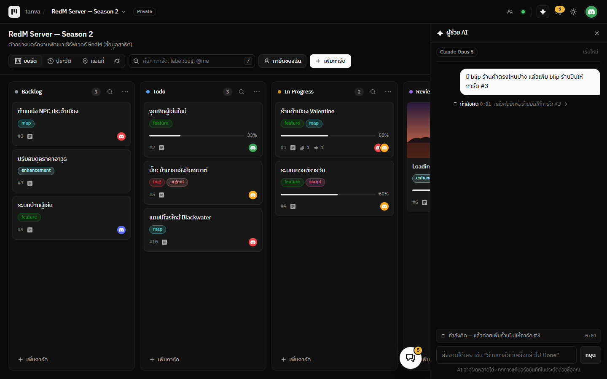

# AI Assistant

ผู้ช่วย AI สำหรับ [Tanva Kanban](https://github.com/QUITFIL3/tanva-kanban) — **แผงด้านขวาของจอ** สั่งงานบอร์ดด้วยภาษาคน
บอกสถานะตลอดว่ากำลังคิดอะไร ใช้เวลาไปเท่าไร และใช้ความสามารถของปลั๊กอินอื่นในบอร์ดได้ (เช่นแผนที่ RedM)
ใช้ได้หลายเจ้า: **Claude, OpenAI, OpenRouter, Google Gemini, Groq, DeepSeek, Mistral, xAI (Grok)**

- “สรุปงานที่ค้างใน In Progress” · “การ์ดไหนยังไม่มีคนรับผิดชอบ” · “งานไหนไม่ขยับเกิน 7 วัน”
- “สร้างการ์ดเช็กลิสต์เตรียมเปิดเซิร์ฟเวอร์ ในคอลัมน์ Todo ให้ Bank รับผิดชอบ”
- “ย้ายการ์ดที่ติ๊กครบทุกข้อแล้วไป Done” · “ติด label bug ให้การ์ด #12”
- เปิดปลั๊กอินแผนที่ RedM ไว้ด้วย: “มี blip ร้านค้าตรงไหนบ้าง” · “เพิ่ม blip ร้านปืนที่ vec3(-281, 780.7, 119.5) ให้การ์ด #3”
- ในหน้าการ์ดมีปุ่มลัด **สรุปการ์ดนี้** และ **แตกเป็นเช็กลิสต์** (เปิดแผงแล้วส่งคำสั่งให้เอง)

## ติดตั้ง

1. เมนูบอร์ด → **ปลั๊กอิน / ติดตั้งเพิ่ม** → แท็บ **ติดตั้งเพิ่ม** → **AI Assistant** → **ติดตั้ง**
2. แท็บ **จัดการปลั๊กอิน** → กด **ตั้งค่า** ที่ AI Assistant → หน้าต่างตั้งค่า → กล่อง **คีย์ลับ** → วาง API key ของเจ้าที่จะใช้ → **บันทึก** (แอดมินเท่านั้น · ตั้งแค่เจ้าที่ใช้ก็พอ)
3. เลือก **ผู้ให้บริการ AI** (และโมเดลถ้าต้องการ) ในช่องตั้งค่าของหน้าต่างเดียวกัน → **บันทึกการตั้งค่า**
4. กด **ปุ่มรูปประกาย** บนหัวเว็บ — แผงผู้ช่วย AI เปิดทางขวาของจอ ใช้คู่กับบอร์ดหรือแผนที่ได้เลย

## ดูได้ตลอดว่า AI กำลังทำอะไร

- **แถบสถานะ** เหนือช่องพิมพ์: กำลังคิดเรื่องอะไร (ประโยคล่าสุดของความคิด) · กำลังดูการ์ด/ใช้เครื่องมืออะไร · รอคุณอนุญาต — พร้อม**เวลาที่ใช้ไป**นับทุกวินาที
- **ก้อนความคิด** ในบทสนทนา: ระหว่างคิดขึ้น “กำลังคิด 0:05” คิดเสร็จเป็น “คิดอยู่ 5 วินาที” กดกางดูสรุปความคิดทั้งหมดได้
- **ท้ายคำตอบ** บอกว่าใช้เวลาเท่าไร เรียกเครื่องมือกี่ครั้ง เช่น “ใช้เวลา 12 วินาที · ใช้เครื่องมือ 3 ครั้ง”
- ความคิดมาจาก Claude (สรุปความคิด) และจากเจ้าที่ส่งมาให้ เช่น DeepSeek และบางโมเดลใน OpenRouter — เจ้าอื่นยังเห็นสถานะและเวลาเหมือนกัน

## ใช้ความสามารถของปลั๊กอินอื่นในบอร์ด

ปลั๊กอินที่เปิดในบอร์ดเดียวกันส่ง**คู่มือ**และ**เครื่องมือ**ของตัวเองให้ AI ได้ — AI จะรู้วิธีใช้และเรียกใช้เองเมื่อเกี่ยวข้อง

| ปลั๊กอิน | AI ทำอะไรได้ |
| --- | --- |
| [RedM Blips Location](../redm_blips_location) | รู้วิธีเขียนบล็อก `!blip` และรูป blip ของเกม · `list_blips` ดู/ค้น blip ทั้งบอร์ด · `add_blip` เพิ่ม blip ลงการ์ด |

- เครื่องมือที่แก้ข้อมูลของปลั๊กอินอื่นก็ต้อง**กดอนุญาตก่อน**เหมือนกัน และใช้ไม่ได้เมื่อปิด “ให้ AI แก้บอร์ดได้”
- ในแชทจะขึ้นชื่อปลั๊กอินกำกับ เช่น “RedM Blips Location: เพิ่ม blip “ร้านปืน” ลงการ์ด #3”
- เขียนปลั๊กอินให้ AI ใช้ได้: ดู [คู่มือปลั๊กอิน → ให้ผู้ช่วย AI ใช้ปลั๊กอินของคุณ](https://github.com/QUITFIL3/tanva-kanban/blob/main/docs/plugins.md#ให้ผู้ช่วย-ai-ใช้ปลั๊กอินของคุณ-ai)

## ผู้ให้บริการที่รองรับ

| ผู้ให้บริการ | สร้าง API key ที่ | โมเดลเริ่มต้น |
| --- | --- | --- |
| **Claude** (Anthropic) | [console.anthropic.com](https://console.anthropic.com/settings/keys) — ขึ้นต้นด้วย `sk-ant-` | Claude Opus 5 (เลือก Sonnet 5 / Haiku 4.5 ได้) |
| **OpenAI** | [platform.openai.com/api-keys](https://platform.openai.com/api-keys) — ขึ้นต้นด้วย `sk-` | `gpt-5-mini` |
| **OpenRouter** | [openrouter.ai/keys](https://openrouter.ai/keys) — ขึ้นต้นด้วย `sk-or-` | `openrouter/auto` (OpenRouter เลือกโมเดลให้) |
| **Google Gemini** | [aistudio.google.com/apikey](https://aistudio.google.com/apikey) | `gemini-2.5-flash` |
| **Groq** | [console.groq.com/keys](https://console.groq.com/keys) — ขึ้นต้นด้วย `gsk_` | `llama-3.3-70b-versatile` |
| **DeepSeek** | [platform.deepseek.com/api_keys](https://platform.deepseek.com/api_keys) | `deepseek-chat` |
| **Mistral** | [console.mistral.ai/api-keys](https://console.mistral.ai/api-keys) | `mistral-large-latest` |
| **xAI** (Grok) | [console.x.ai](https://console.x.ai) — ขึ้นต้นด้วย `xai-` | `grok-4` |

**OpenRouter** — คีย์เดียวใช้ได้หลายร้อยโมเดลจากหลายเจ้า ใส่ชื่อโมเดลตามหน้า [openrouter.ai/models](https://openrouter.ai/models) ในช่อง **โมเดล** เช่น
`anthropic/claude-sonnet-4.5` · `openai/gpt-5` · `google/gemini-2.5-pro` · `deepseek/deepseek-chat-v3.1`

> เลือกโมเดลที่รองรับ **tool calling** (function calling) — AI ต้องใช้เครื่องมือเพื่ออ่านและแก้บอร์ด
> โมเดลที่ไม่รองรับจะตอบได้แค่ข้อความ หรือแจ้งข้อผิดพลาดจากผู้ให้บริการ

## ความปลอดภัย

- **API key ไม่เคยถึงเบราว์เซอร์** — เก็บที่เซิร์ฟเวอร์ Tanva และถูกเติมตอนเซิร์ฟเวอร์ส่งต่อคำขอไปยังผู้ให้บริการที่ประกาศไว้ใน `manifest.json` เท่านั้น
- **ถามก่อนแก้ทุกครั้ง** (ค่าเริ่มต้น) — กด อนุญาต / ไม่อนุญาต / อนุญาตทั้งหมดในคำสั่งนี้ · หรือปิดสิทธิ์แก้ไขให้ AI อ่านอย่างเดียว
- AI ทำงาน **ด้วยสิทธิ์ของคนที่สั่ง** — แก้การ์ดที่คนนั้นแก้ไม่ได้ก็ทำไม่ได้ การ์ดที่มีคนกำลังแก้อยู่ก็ไม่ไปแตะ
- ทุกการแก้บันทึกใน **แท็บประวัติ** ด้วยชื่อคนที่สั่ง
- ใช้ได้เฉพาะบอร์ดที่เปิดปลั๊กอิน และจำกัดจำนวนครั้งต่อนาทีต่อคน (`PLUGIN_PROXY_PER_MINUTE` ของเซิร์ฟเวอร์)
- ข้อมูลบอร์ดที่ AI อ่าน (ชื่อ/รายละเอียดการ์ด ชื่อสมาชิก) ถูกส่งไปยังผู้ให้บริการที่เลือก (OpenRouter ส่งต่อให้เจ้าของโมเดลอีกทอด) —
  ตรวจนโยบายข้อมูลของผู้ให้บริการก่อนใช้กับข้อมูลสำคัญ

## ตั้งค่า (แยกรายบอร์ด)

| ค่าตั้ง | ค่าเริ่มต้น | ความหมาย |
| --- | --- | --- |
| ผู้ให้บริการ AI | Claude | เจ้าไหนก็ได้จาก 8 เจ้าด้านบน (ต้องตั้งคีย์ของเจ้านั้นไว้) |
| โมเดล Claude | Claude Opus 5 | Opus 5 (เก่งที่สุด) · Sonnet 5 (เร็วขึ้น ถูกลง) · Haiku 4.5 (เร็วที่สุด ถูกที่สุด) |
| ความละเอียดในการคิด (Claude) | ค่าเริ่มต้นของโมเดล | น้อย / ปานกลาง / มาก |
| โมเดล (ผู้ให้บริการอื่นนอกจาก Claude) | ว่าง | ว่าง = โมเดลเริ่มต้นของเจ้านั้น (ตารางด้านบน) · หรือใส่ชื่อโมเดลตามหน้ารายการโมเดลของผู้ให้บริการ |
| ให้ AI แก้บอร์ดได้ | เปิด | ปิด = อ่านอย่างเดียว (ค้น/สรุปได้ แก้ไม่ได้) |
| ถามก่อนทุกครั้งที่ AI จะแก้บอร์ด | เปิด | ปิด = ทำเลยไม่ต้องถาม |
| คำสั่งเพิ่มเติมถึง AI | — | เช่น “ตอบสั้น ๆ” หรือ “การ์ดใหม่ให้ติด label todo เสมอ” |

ชื่อผู้ให้บริการและโมเดลที่ใช้อยู่ขึ้นที่หัวแผง · เปลี่ยนผู้ให้บริการหรือโมเดล = เริ่มบทสนทนาใหม่

## AI ทำอะไรได้บ้าง

| เครื่องมือ | ทำอะไร |
| --- | --- |
| `list_cards` | ดูรายการการ์ด กรองตามคอลัมน์ / label / คน / คำค้น / ที่ยังไม่มีคนรับ |
| `get_card` | อ่านการ์ดเต็ม ๆ (รายละเอียด ไฟล์แนบ วันที่) |
| `create_card` | สร้างการ์ด (ชื่อ รายละเอียด markdown คอลัมน์ labels ผู้รับผิดชอบ) |
| `update_card` | แก้ชื่อ รายละเอียด labels ผู้รับผิดชอบ (รวมถึงติ๊กเช็กลิสต์) |
| `move_card` | ย้ายไปคอลัมน์อื่น (บนสุด/ล่างสุด) |
| `archive_card` | เก็บเข้าคลัง / นำออกจากคลัง |
| `create_label` | สร้าง label ใหม่ |

## รายละเอียดทางเทคนิค

- แผงด้านขวาใช้ `panels` ของระบบปลั๊กอิน — เปิดค้างไว้ข้างบอร์ด/แผนที่ได้ และเปิดกลับให้เองเมื่อโหลดหน้าใหม่ · บนมือถือแผงเต็มจอ
- Claude เรียกผ่าน Anthropic SDK ทางการ (`@anthropic-ai/sdk`) แบบสตรีม: คิดแบบ adaptive บน Opus/Sonnet พร้อม `display: "summarized"` (ส่งสรุปความคิดมาโชว์สถานะ),
  เปิด `fallbacks: "default"` บน Claude Opus 5 (ถ้าโดนตัวกรองความปลอดภัยปฏิเสธ เซิร์ฟเวอร์ของ Anthropic ลองโมเดลสำรองให้เอง) และใช้ prompt caching
- เครื่องมือของปลั๊กอินอื่นอ่านจาก `host.pluginExports('ai')` ทุกครั้งที่ส่งคำสั่ง — ต้องใช้ Tanva Kanban รุ่นที่มี `pluginExports` (รุ่นเก่ากว่าใช้ได้ปกติ แค่ไม่มีเครื่องมือของปลั๊กอินอื่น)
- เจ้าอื่นทั้งหมดเรียกผ่าน SDK ทางการของ OpenAI (`openai`) กับ API แบบ OpenAI — Chat Completions + function calling
  (เพิ่มเจ้าใหม่ได้ที่ `providers.js` + `secrets`/`proxy` ใน `manifest.json`)
- SDK โหลดจาก jsDelivr (ระบุเวอร์ชันชัดเจน) และชี้ `baseURL` ไปที่ proxy ของเซิร์ฟเวอร์ Tanva
- ประวัติการคุยอยู่ในหน้าเว็บ แยกตามบอร์ด (หายเมื่อรีเฟรชหรือกด **เริ่มใหม่**) ไม่ถูกเก็บที่เซิร์ฟเวอร์
- ต้องใช้ Tanva Kanban รุ่นที่รองรับ `panels` / `secrets` / `proxy` ในระบบปลั๊กอิน
