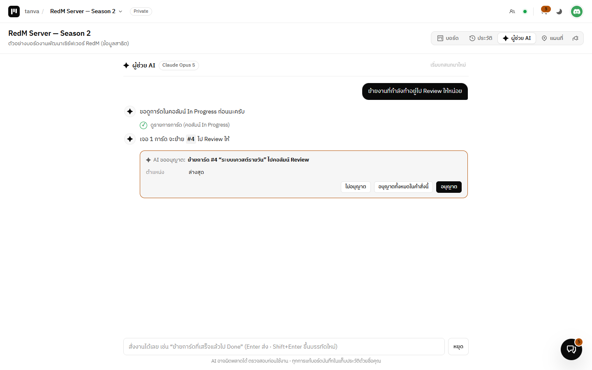
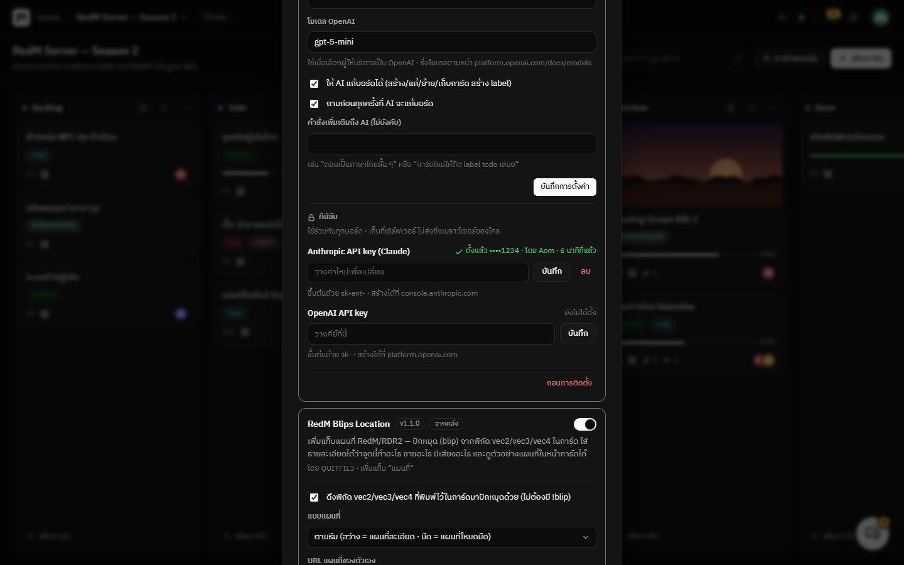

# AI Assistant

ผู้ช่วย AI สำหรับ [Tanva Kanban](https://github.com/QUITFIL3/tanva-kanban) — สั่งงานบอร์ดด้วยภาษาคน ใช้ได้ทั้ง **Claude** และ **OpenAI**

- “สรุปงานที่ค้างใน In Progress” · “การ์ดไหนยังไม่มีคนรับผิดชอบ” · “งานไหนไม่ขยับเกิน 7 วัน”
- “สร้างการ์ดเช็กลิสต์เตรียมเปิดเซิร์ฟเวอร์ ในคอลัมน์ Todo ให้ Bank รับผิดชอบ”
- “ย้ายการ์ดที่ติ๊กครบทุกข้อแล้วไป Done” · “ติด label bug ให้การ์ด #12”
- ในหน้าการ์ดมีปุ่มลัด **สรุปการ์ดนี้** และ **แตกเป็นเช็กลิสต์**

## ติดตั้ง

1. เมนูบอร์ด → **ปลั๊กอิน / ติดตั้งเพิ่ม** → แท็บ **ติดตั้งเพิ่ม** → **AI Assistant** → **ติดตั้ง**
2. แท็บ **ในบอร์ดนี้** → การ์ดของ AI Assistant → กล่อง **คีย์ลับ** → วาง API key ของเจ้าที่จะใช้ → **บันทึก** (แอดมินเท่านั้น)
   - Claude: สร้างคีย์ที่ [console.anthropic.com](https://console.anthropic.com) (ขึ้นต้นด้วย `sk-ant-`)
   - OpenAI: สร้างคีย์ที่ [platform.openai.com](https://platform.openai.com) (ขึ้นต้นด้วย `sk-`)
3. เลือกผู้ให้บริการ/โมเดลในตั้งค่าของบอร์ด แล้วเปิดแท็บ **ผู้ช่วย AI**

## ความปลอดภัย

- **API key ไม่เคยถึงเบราว์เซอร์** — เก็บที่เซิร์ฟเวอร์ Tanva และถูกเติมตอนเซิร์ฟเวอร์ส่งต่อคำขอไป `api.anthropic.com` / `api.openai.com` เท่านั้น
- **ถามก่อนแก้ทุกครั้ง** (ค่าเริ่มต้น) — กด อนุญาต / ไม่อนุญาต / อนุญาตทั้งหมดในคำสั่งนี้ · หรือปิดสิทธิ์แก้ไขให้ AI อ่านอย่างเดียว
- AI ทำงาน **ด้วยสิทธิ์ของคนที่สั่ง** — แก้การ์ดที่คนนั้นแก้ไม่ได้ก็ทำไม่ได้ การ์ดที่มีคนกำลังแก้อยู่ก็ไม่ไปแตะ
- ทุกการแก้บันทึกใน **แท็บประวัติ** ด้วยชื่อคนที่สั่ง
- ใช้ได้เฉพาะบอร์ดที่เปิดปลั๊กอิน และจำกัดจำนวนครั้งต่อนาทีต่อคน (`PLUGIN_PROXY_PER_MINUTE` ของเซิร์ฟเวอร์)
- ข้อมูลบอร์ดที่ AI อ่าน (ชื่อ/รายละเอียดการ์ด ชื่อสมาชิก) ถูกส่งไปยังผู้ให้บริการ AI ที่เลือก — ตรวจนโยบายข้อมูลของผู้ให้บริการก่อนใช้กับข้อมูลสำคัญ

## ตั้งค่า (แยกรายบอร์ด)

| ค่าตั้ง | ค่าเริ่มต้น | ความหมาย |
| --- | --- | --- |
| ผู้ให้บริการ AI | Claude | Claude (Anthropic) หรือ OpenAI |
| โมเดล Claude | Claude Opus 5 | Opus 5 (เก่งที่สุด) · Sonnet 5 (เร็วขึ้น ถูกลง) · Haiku 4.5 (เร็วที่สุด ถูกที่สุด) |
| ความละเอียดในการคิด | ค่าเริ่มต้นของโมเดล | น้อย / ปานกลาง / มาก (Claude Opus/Sonnet) |
| โมเดล OpenAI | `gpt-5-mini` | ชื่อโมเดลตามหน้า [platform.openai.com/docs/models](https://platform.openai.com/docs/models) |
| ให้ AI แก้บอร์ดได้ | เปิด | ปิด = อ่านอย่างเดียว (ค้น/สรุปได้ แก้ไม่ได้) |
| ถามก่อนทุกครั้งที่ AI จะแก้บอร์ด | เปิด | ปิด = ทำเลยไม่ต้องถาม |
| คำสั่งเพิ่มเติมถึง AI | — | เช่น “ตอบสั้น ๆ” หรือ “การ์ดใหม่ให้ติด label todo เสมอ” |

## AI ทำอะไรได้บ้าง

| เครื่องมือ | ทำอะไร |
| --- | --- |
| `list_cards` | ดูรายการการ์ด กรองตามคอลัมน์ / label / คน / คำค้น / ที่ยังไม่มีคนรับ |
| `get_card` | อ่านการ์ดเต็ม ๆ (รายละเอียด ไฟล์แนบ วันที่) |
| `create_card` | สร้างการ์ด (ชื่อ รายละเอียด markdown คอลัมน์ labels ผู้รับผิดชอบ) |
| `update_card` | แก้ชื่อ รายละเอียด labels ผู้รับผิดชอบ (รวมถึงติ๊กเช็กลิสต์) |
| `move_card` | ย้ายไปคอลัมน์อื่น (บนสุด/ล่างสุด) |
| `archive_card` | เก็บเข้าคลัง / นำออกจากคลัง |
| `create_label` | สร้าง label ใหม่ |

## รายละเอียดทางเทคนิค

- Claude เรียกผ่าน Anthropic SDK ทางการ (`@anthropic-ai/sdk`) แบบสตรีม: คิดแบบ adaptive บน Opus/Sonnet,
  เปิด `fallbacks: "default"` บน Claude Opus 5 (ถ้าโดนตัวกรองความปลอดภัยปฏิเสธ เซิร์ฟเวอร์ของ Anthropic ลองโมเดลสำรองให้เอง) และใช้ prompt caching
- OpenAI เรียกผ่าน SDK ทางการ (`openai`) — Chat Completions + function calling
- ทั้งสอง SDK โหลดจาก jsDelivr (ระบุเวอร์ชันชัดเจน) และชี้ `baseURL` ไปที่ proxy ของเซิร์ฟเวอร์ Tanva
- ประวัติการคุยอยู่ในหน้าเว็บ (หายเมื่อรีเฟรชหรือกด **เริ่มบทสนทนาใหม่**) ไม่ถูกเก็บที่เซิร์ฟเวอร์
- ต้องใช้ Tanva Kanban รุ่นที่รองรับ `secrets` / `proxy` ในระบบปลั๊กอิน
