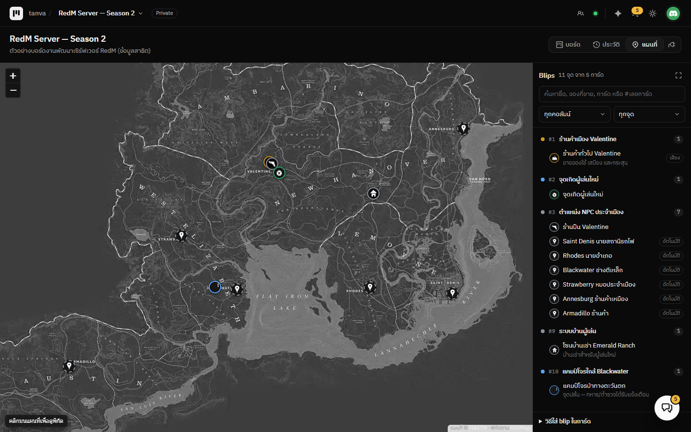
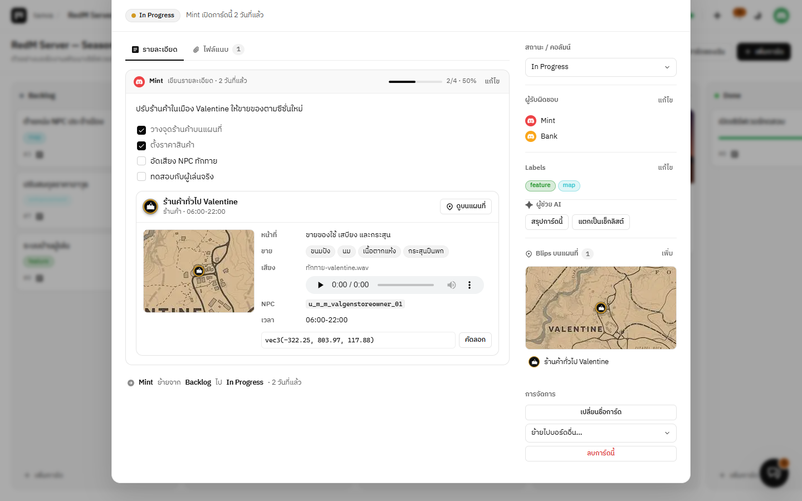
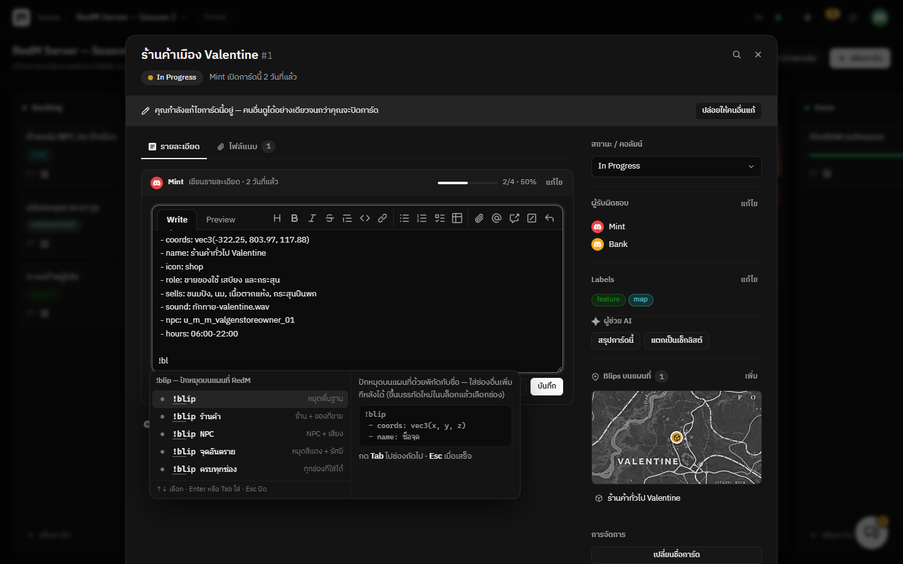
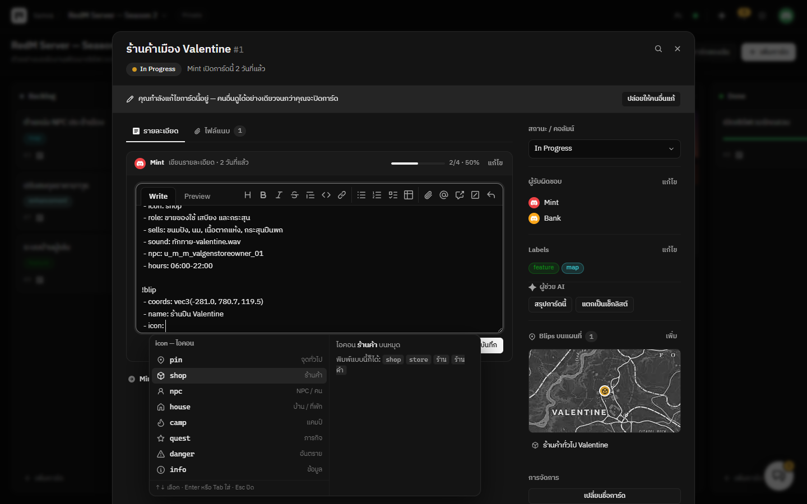
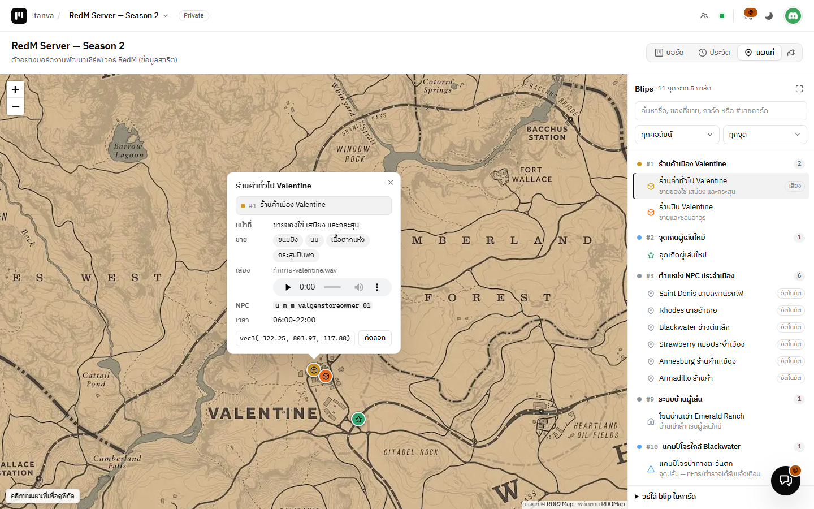

# RedM Blips Location

แท็บ **แผนที่ RedM / RDR2** สำหรับ [Tanva Kanban](https://github.com/QUITFIL3/tanva-kanban) — ปักหมุด (blip) จากพิกัดในการ์ดทุกใบของบอร์ด
ใส่ได้ว่าจุดนี้ทำอะไร ขายอะไร มีเสียงอะไร ดูตัวอย่างแผนที่ได้ในหน้าการ์ด และมี **คำแนะนำตอนพิมพ์ (IntelliSense)** ให้เขียน `!blip` ได้ไวไม่ต้องจำ



## ติดตั้ง

เมนูบอร์ด → **ปลั๊กอิน / ติดตั้งเพิ่ม** → แท็บ **ติดตั้งเพิ่ม** → **RedM Blips Location** → **ติดตั้ง**
แล้วแท็บ **แผนที่** จะขึ้นต่อจาก **บอร์ด / ประวัติ**

## ใส่ blip ในการ์ด

พิมพ์ในรายละเอียดการ์ด (หนึ่งการ์ดมีได้หลาย blip):

```
!blip
 - coords: vec3(-322.25, 803.97, 117.88)
 - name: ร้านค้าทั่วไป Valentine
```

ใส่รายละเอียดเพิ่มได้ตามต้องการ:

```
!blip
 - coords: vec3(-281.0, 780.7, 119.5)
 - name: ร้านปืน Valentine
 - icon: shop
 - color: orange
 - role: ขายและซ่อมอาวุธ
 - sells:
   - ปืนพก Cattleman 50$
   - ไรเฟิล Springfield 156$
 - sound: ทักทาย-valentine.wav
 - npc: u_m_m_valgenstoreowner_01
 - hours: 06:00-22:00
 - ส่วนลดสมาชิก: 10%
```



ในหน้าการ์ด บล็อก `!blip` จะกลายเป็นกล่องที่มี **แผนที่ย่อ** รายละเอียด เครื่องเล่นเสียง และปุ่ม **ดูบนแผนที่**
ส่วนแถบข้างของการ์ดมีกล่อง **Blips บนแผนที่** รวมทุกจุดของการ์ดใบนั้น

### คำแนะนำตอนพิมพ์ (IntelliSense)

ตอนแก้รายละเอียดการ์ด ช่องเขียนจะช่วยเขียน `!blip` ให้เหมือนในโปรแกรมเขียนโค้ด



| พิมพ์ / ทำ | ได้อะไร |
| --- | --- |
| `!` ต้นบรรทัด | แม่แบบ `!blip` 5 แบบ — พื้นฐาน · ร้านค้า · NPC · จุดอันตราย · ครบทุกช่อง พร้อมตัวอย่างด้านข้าง |
| เลือกแม่แบบแล้ว | ช่องที่ต้องกรอกถูกเลือกไว้ให้พิมพ์ทับ — **Tab** ไปช่องถัดไป (x → y → z → ชื่อ …) · **Shift+Tab** ย้อนกลับ · **Esc** เสร็จ |
| ขึ้นบรรทัดใหม่ในบล็อก | รายการ **ช่องที่ยังไม่ได้ใส่** พร้อมคำอธิบายและตัวอย่าง (ยังไม่เลือกอะไรจนกว่าจะกดลูกศรหรือพิมพ์ต่อ — กด Enter ซ้ำเพื่อจบบล็อกได้ตามปกติ) |
| พิมพ์ชื่อช่องบางส่วน | กรองรายการ — พิมพ์ภาษาไทยก็ได้ เช่น `พิ` → `พิกัด` · `เสี` → `เสียง` |
| หลัง `icon:` | ไอคอนทั้ง 8 แบบพร้อมรูป |
| หลัง `color:` | ชื่อสีพร้อมตัวอย่างสี (พิมพ์ `แดง` ก็เจอ `red`) หรือ `#hex` |
| หลัง `coords:` | แม่แบบ `vec2` `vec3` `vec4` และ **พิกัดของ blip อื่นในบอร์ด** (ค้นจากชื่อจุดได้) |
| หลัง `sound:` | **ไฟล์เสียงที่แนบในการ์ดนี้** — ไม่มีก็แนะนำให้ใส่ลิงก์ |
| หลัง `sells:` `npc:` `role:` | ค่าที่เคยใช้ในจุดอื่นของบอร์ด (ของที่ใส่ในบรรทัดแล้วไม่แนะนำซ้ำ) |
| หลัง `radius:` `hours:` `name:` | ค่าที่ใช้บ่อย และชื่อการ์ด |
| **Ctrl+Space** | เปิดรายการเองตรงไหนก็ได้ในบล็อก (เช่นอยากเปลี่ยนค่าที่ใส่ไว้แล้ว) |



เลือกด้วย **↑ ↓** แล้วกด **Enter** หรือ **Tab** · **Esc** ปิดรายการ · บนมือถือแตะรายการได้เลย
(ต้องใช้ Tanva Kanban รุ่นที่มีคำแนะนำตอนพิมพ์ในช่องเขียน — รุ่นเก่ากว่านั้นปลั๊กอินยังใช้ได้ปกติ แค่ไม่มีรายการขึ้น)

### ช่องทั้งหมด

| ช่อง | ชื่ออื่นที่ใช้ได้ | ความหมาย |
| --- | --- | --- |
| `coords` **(จำเป็น)** | `coord` `coordinates` `pos` `position` `location` `loc` `พิกัด` `ตำแหน่ง` | `vec2(x, y)` `vec3(x, y, z)` `vec4(x, y, z, h)` หรือ `vector2/3/4(…)` หรือตัวเลขคั่นจุลภาค |
| `name` | `title` `label` `ชื่อ` | ชื่อบนแผนที่ — หรือเขียนต่อท้ายแบบ `!blip ร้านค้า` · ไม่ใส่ = ใช้ชื่อการ์ด |
| `icon` | `type` `sprite` `ไอคอน` `ประเภท` | `shop` `npc` `house` `camp` `quest` `danger` `info` `pin` (ค่าเริ่มต้น) |
| `color` | `colour` `สี` | `#hex` หรือ `red` `orange` `yellow` `green` `blue` `purple` `pink` `white` `gray` `black` · ไม่ใส่ = สีของคอลัมน์ |
| `radius` | `range` `รัศมี` | วาดวงรัศมีรอบจุด (หน่วยในเกม) |
| `role` | `purpose` `function` `job` `หน้าที่` `บทบาท` | จุดนี้มีหน้าที่ทำอะไร |
| `sells` | `sell` `shop` `items` `goods` `ขาย` `สินค้า` `ของขาย` | ของที่ขาย — คั่นด้วย `,` หรือเขียนเป็นรายการย่อยด้านล่าง |
| `sound` | `sounds` `audio` `voice` `เสียง` | ไฟล์เสียง: ชื่อไฟล์ที่แนบในการ์ด, `[ชื่อ](/uploads/…)` หรือ URL `https://` — หลายเสียงได้ |
| `npc` | `ped` `model` `โมเดล` | ชื่อโมเดล NPC |
| `hours` | `open` `time` `เวลา` `เวลาเปิด` | เวลาเปิด-ปิด |
| `note` | `notes` `desc` `description` `หมายเหตุ` `รายละเอียด` | ข้อความเพิ่มเติม |
| *ตั้งชื่อเอง* | | เช่น `- ราคาเช่า: 30$ ต่อสัปดาห์` — ขึ้นในกล่องรายละเอียดด้วย |

ไอคอนพิมพ์เป็นภาษาไทยได้: `ร้าน` `ร้านค้า` `คน` `บ้าน` `แคมป์` `ภารกิจ` `เควส` `อันตราย` `ข้อมูล` `จุด`

blip ที่ข้อมูลยังไม่ครบ (เช่น `coords: vec2()`) จะขึ้นเตือนในแถบข้างของแผนที่และในหน้าการ์ด

### ดึงพิกัดอัตโนมัติ

ถ้าเปิด **ดึงอัตโนมัติ** (เปิดไว้เป็นค่าเริ่มต้น) พิกัด `vec2/3/4(…)` ที่พิมพ์ไว้ตรงไหนก็ได้ในการ์ดจะขึ้นบนแผนที่ด้วย
โดยใช้ข้อความในบรรทัดนั้น หรือหัวข้อแม่ของรายการเป็นชื่อ — ไม่ต้องเขียน `!blip` · พิกัดในบล็อกโค้ด ```` ``` ```` ไม่นับ

```
- NPC ประจำเมือง
  - คนขายหนังสัตว์ vec4(-334.2, 773.5, 116.3, 180.0)
```

## ใช้แผนที่



- **รายการด้านข้าง** — ค้นหาจากชื่อ ของที่ขาย ชื่อการ์ด หรือ `#เลขการ์ด` · กรองตามคอลัมน์ หรือเฉพาะ `!blip` / เฉพาะที่ดึงอัตโนมัติ
- **กดหมุด** — ดูหน้าที่ ของที่ขาย เสียง NPC เวลาเปิด พิกัด และปุ่มเปิดการ์ด
- **คลิกหรือคลิกขวาบนแผนที่** — ดูพิกัดในเกม คัดลอก หรือ **เพิ่มเป็น blip ในการ์ด…** (เลือกการ์ดแล้วกรอกฟอร์มได้เลย)
- ปุ่ม **ซูมให้เห็นทุกจุด** และ **คัดลอกตัวอย่าง** อยู่ในแถบด้านข้าง
- ใช้บนมือถือได้ (แผนที่อยู่บน รายการอยู่ล่าง)

## ตั้งค่า (แยกรายบอร์ด)

| ค่าตั้ง | ค่าเริ่มต้น | ความหมาย |
| --- | --- | --- |
| ดึงพิกัดอัตโนมัติ | เปิด | ปักหมุดจาก `vec2/3/4` ที่พิมพ์ไว้เฉย ๆ ด้วย |
| แบบแผนที่ | ตามธีม | ตามธีม (สว่าง = ละเอียด · มืด = โหมดมืด) / แผนที่ละเอียด / โหมดมืด / แผนที่ในเกม / URL ของตัวเอง |
| URL แผนที่ของตัวเอง | — | รูปแบบ Leaflet เช่น `https://example.com/tiles/{z}/{x}_{y}.webp` |
| แสดงการ์ดที่เก็บเข้าคลัง | ปิด | ปักหมุดจากการ์ดที่เก็บเข้าคลังแล้วด้วย |

## หมายเหตุ

- ต้องต่ออินเทอร์เน็ตเพื่อโหลดแผนที่และ [Leaflet](https://leafletjs.com) (จาก jsDelivr) — ข้อมูลการ์ดไม่ถูกส่งออกไปไหน
- ไฟล์เสียงเล่นได้เฉพาะไฟล์ที่แนบในเซิร์ฟเวอร์ (`/uploads/…`) หรือลิงก์ `https://`
- แปลงพิกัดในเกม → แผนที่ด้วยค่าเดียวกับ RDOMap: `lat = 0.01552 × y − 63.6`, `lng = 0.01552 × x + 111.29`

## เครดิต

แผนที่ละเอียดจาก [RDR2Map](https://rdr2map.com/) · แผนที่โหมดมืดจาก [TDLCTV](https://github.com/TDLCTV) ·
แผนที่ในเกม © [Rockstar Games](https://www.rockstargames.com/) · การแปลงพิกัดตาม [RDOMap](https://github.com/jeanropke/RDOMap) ·
แสดงผลด้วย [Leaflet](https://leafletjs.com) (BSD-2-Clause)

ปลั๊กอินนี้ไม่ได้มีส่วนเกี่ยวข้องหรือได้รับการรับรองจาก Rockstar Games หรือ Cfx.re
